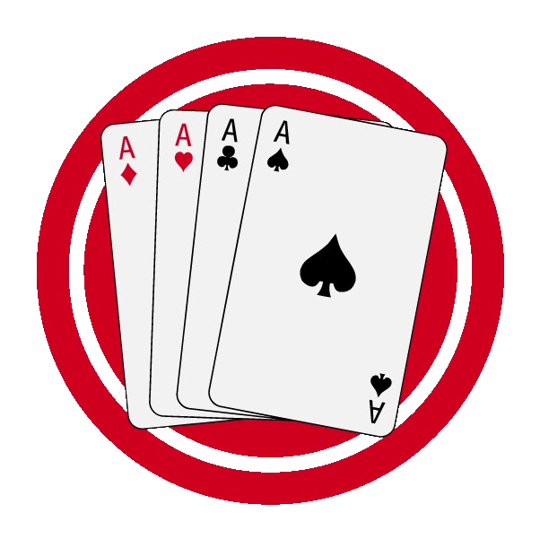

# Santase Game Engine



**Santase** (also known as **66**, Сантасе, **Sixty-six** or **Sechsundsechzig**) is a
well-known card game in Bulgaria, also played in Germany and Austria (as **Schnapsen**).

It is a fast **6-card game** for **2 players**, played with a 24-card deck consisting of
the _Ace_, _Ten_, _King_, _Queen_, _Jack_ and _Nine_ of each suit.

The core engine in `src/Santase.Logic` is published as the
[**SantaseGameEngine**](https://www.nuget.org/packages/SantaseGameEngine) NuGet package
(MIT, currently version `3.0.0`, targeting **.NET 10**). Everything else in the repository
is AI players, UIs and a benchmarking simulator built on top of that engine.

## Rules of the game

The full rules **as implemented by this engine** are documented in [RULES.md](RULES.md).

External references (these describe different variants and do not match this engine
exactly):

- Wikipedia (EN): <https://en.wikipedia.org/wiki/Sixty-six_(card_game)>
- Wikipedia (BG): <https://bg.wikipedia.org/wiki/%D0%A1%D0%B0%D0%BD%D1%82%D0%B0%D1%81%D0%B5>

## Repository layout

```
src/Santase.sln                 Visual Studio 2026 solution

src/Santase.Logic               The engine — the SantaseGameEngine NuGet package
src/AI/Santase.AI.DummyPlayer   Baseline legal-random players
src/AI/Santase.AI.SmartPlayer   Heuristic AI player
src/AI/Santase.AI.ClaudePlayer  AI player (incl. an optional neural variant)
src/AI/External/*.dll           Third-party binary AI players (no source)
src/UI/Santase.UI.Console       Human-playable console UI (.NET 10)
src/UI/Santase.UI               Cross-platform .NET MAUI app (Android / iOS / macOS / Windows)
src/Tests/Santase.Logic.Tests             xUnit tests for the engine (255 tests)
src/Tests/Santase.AI.SmartPlayer.Tests    xUnit tests for SmartPlayer
src/Tests/Santase.AI.ClaudePlayer.Tests   xUnit tests for ClaudePlayer
src/Tests/Santase.Tests.GameSimulations   Parallel AI benchmark / game simulator
```

## Source code requirements

- **.NET 10 SDK**
- **Visual Studio 2026** (or any editor with the .NET 10 SDK; Rider / VS Code work too)
- The cross-platform `Santase.UI` MAUI project additionally needs the MAUI workloads
  (`dotnet workload install maui`) and the relevant platform SDKs. It is **not** required
  to build or use the engine.

## Build, test, run

```powershell
# Restore + build the whole solution (Release recommended).
dotnet build src\Santase.sln -c Release

# Run the unit tests (xUnit).
dotnet test src\Santase.sln -c Release

# Run the AI benchmark / game simulator (the primary regression check for AI changes).
dotnet run -c Release --project src\Tests\Santase.Tests.GameSimulations\Santase.Tests.GameSimulations.csproj

# Play against the AI in the console.
dotnet run --project src\UI\Santase.UI.Console\Santase.UI.Console.csproj
```

The `Santase.Logic` library is extensively unit tested (255 tests in
`Santase.Logic.Tests`).

NuGet package: <https://www.nuget.org/packages/SantaseGameEngine>

## Video with creating the initial code (in Bulgarian)

<https://www.youtube.com/watch?v=VidaoNJ4X2Y>
